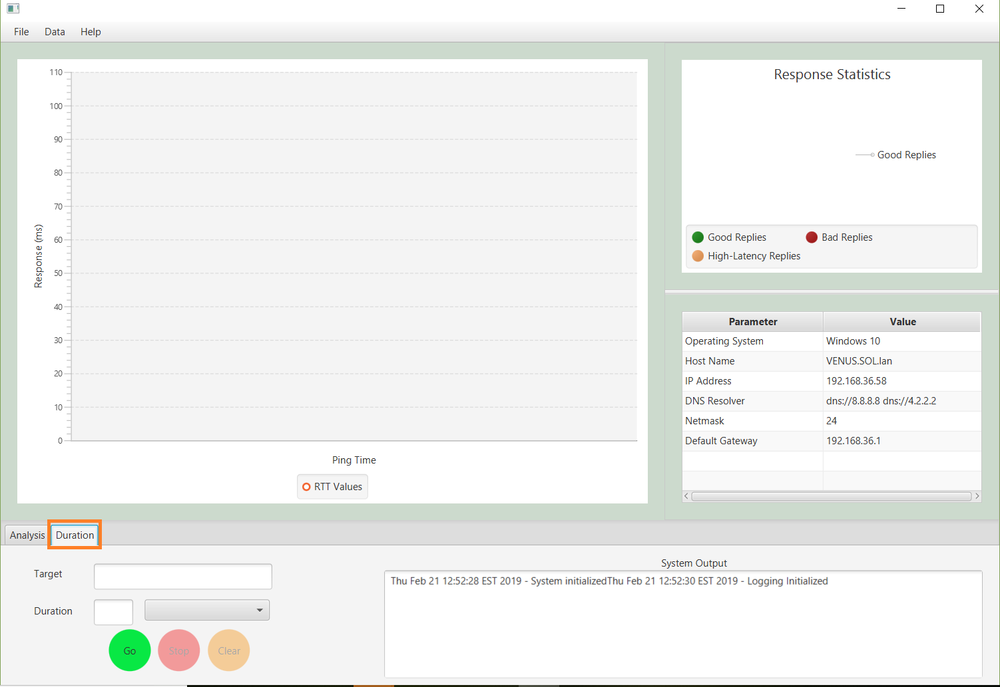
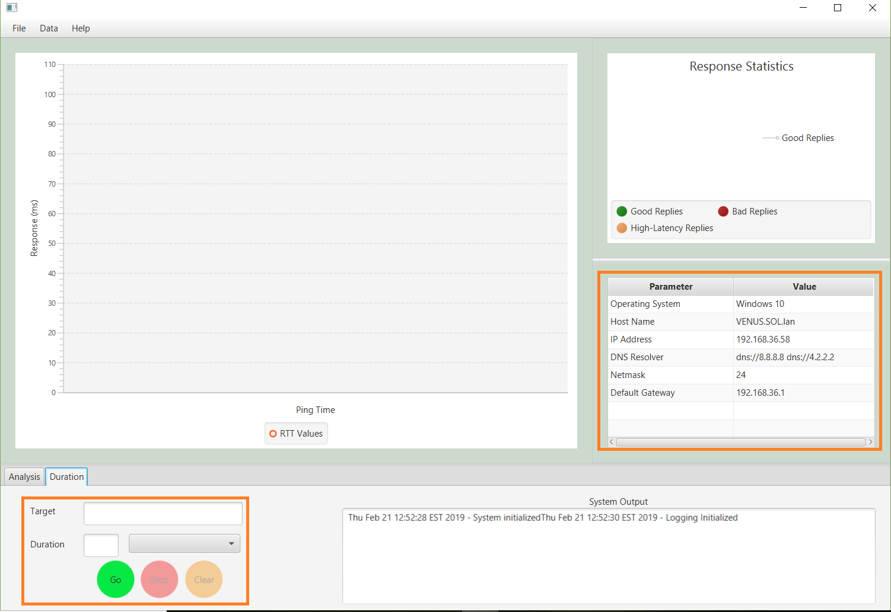
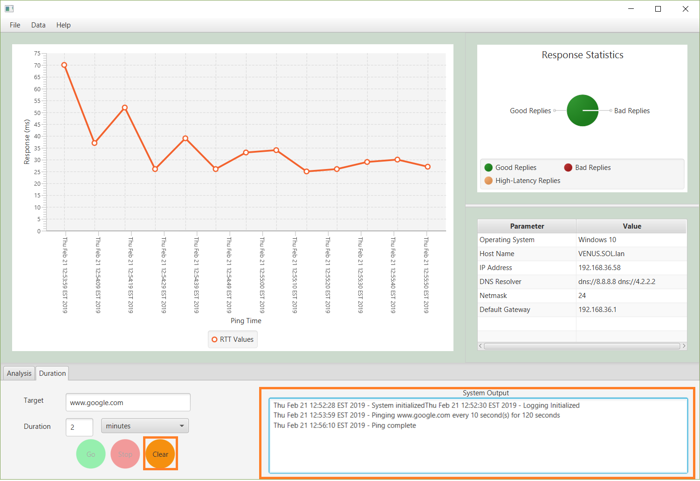

=============
Duration Mode
=============

Introduction
------------
In Duration Mode, the user is responsible for selecting a **ping target** and
**duration** in seconds, minutes, or hours.  The **ping target** can be a local or
external resource via either DNS name or IPv4 address.  A duration can be a minimum of 1
second or a maximum of 12 hours and to limit the quantity of packets the ping interval
is automatically converted to 10 seconds on durations longer than 1 minute and 5 minutes
on durations longer than 1 hour.  The same line graph and pie chart is displayed containing
the results of the operation.  This chart can be used to identify periods of network congestion
for further troubleshooting.

Procedure
---------

1.  Launch the NetUse2 application
2.  In the NetUse2 application, ensure that the **Duration** tab is selected in the Mode panel

3.  Inspect the **System Parameters** panel to verify system network parameters
4.  In the **Duration Tab**, enter the ping **Target** and **Duration** desired and
    click on the **Go** button to begin automatic analysis

5.  Observe the reply time graph and reply statistics chart fill with data and the status log
    populate with process status

    **NOTE:** The **Stop** button is now active to abort the command

.. image:: dur3.png

6.  When the command is complete, inspect the line graph to view reply times over the duration

    **NOTE:** The **Clear** button is now active to reset NetUse2 for another use

7.  If you wish to perform another command, click the **Clear** button to reset NetUse2.
    If you would like to export the data, refer to the :doc:`Data <data>` section to learn
    how to import and export ping data.

